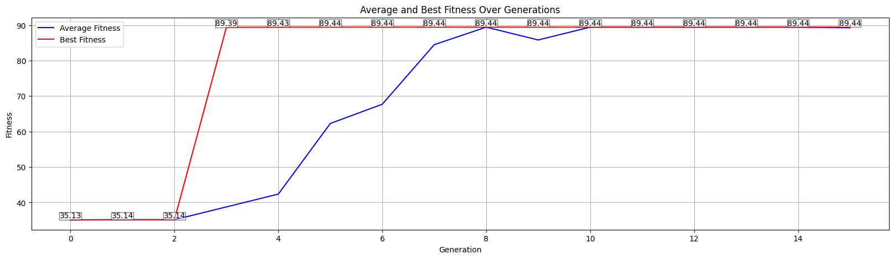

This repo contains the code for a personal project. The main idea is to evolve a compression algorithm written in C with a simple Gentic Algorithm framework.


To run the code evolution process, you'll need to configure the config.yaml file and then execute the main.py script.
Make sure python>=3.10 and install requirements from requirements.txt
LLMs are hosted by [Nebius AI Studio](https://studio.nebius.com/), but it's possible to change the provider by modifying the code in `utils/code_evolver.py`. 

## Genetic Operations: Crossover & Mutation

**Core Idea:** Use an AI (Large Language Model - LLM) to mimic genetic evolution, refining C code for data compression.
---

### 🧬 Mutation: Introducing Variations

- **Concept:** Modifies a single "parent" algorithm to create a new version.
- **Process:**
  1. An existing compression/decompression function pair is selected.
  2. The LLM is prompted to alter these functions.
- **Prompting Strategy (from [`utils/prompts.yaml`](utils/prompts.yaml)):**
  - `premise`: Sets the context (AI specializing in C code optimization for compression).
  - `current_function`: Provides the C code of the parent's [`compress`](utils/code_evolver.py) and [`decompress`](utils/code_evolver.py) functions.
  - `creation_task` (randomly chosen from `base`, `complex`, `uncommon`):
    - `base`: General improvements (ratio, speed, memory).
    - `complex`: Substantial modifications, advanced techniques.
    - `uncommon`: Distinctive or rarely used enhancements.
  - Feedback: Metrics from the parent (fitness, ratio, integrity) are included in the prompt to guide the LLM.
  - `format`: Strict rules on function signatures, data integrity, and output format.
- **Goal:** Explore new solutions by making incremental or sometimes radical changes.

---

### 🔄 Crossover: Combining Strengths

- **Concept:** Merges features from two "parent" algorithms to create an "offspring".
- **Process:**
  1. Two parent algorithms are selected.
  2. The LLM is tasked with combining them.
- **Prompting Strategy (from [`utils/prompts.yaml`](utils/prompts.yaml)):**
  - `premise`: Same as mutation.
  - `crossover_task` (randomly chosen from `base`, `complex`):
    - Provides the [`compress`](utils/code_evolver.py) and [`decompress`](utils/code_evolver.py) functions for both `ALGORITHM 1` and `ALGORITHM 2`.
    - `base`: "Combine the best parts of both algorithms."
    - `complex`: "Mix the best parts... to create a more complex and performant one."
  - Feedback: Metrics from both parents are included to help the LLM identify strong traits.
  - `format`: Same strict output formatting rules apply.
- **Goal:** Create potentially superior algorithms by blending successful traits from different solutions.

---

**Outcome:** Both operations generate new C code for [`compress`](utils/code_evolver.py) and [`decompress`](utils/code_evolver.py) functions. These are then compiled and tested to evaluate their "fitness," driving the evolutionary cycle.

## INSTRUCTIONS

### 1. Modify config.yaml

The config.yaml file controls various parameters for the evolution process. Open config.yaml and adjust the following settings as needed:

*   **`c_file_path`**: Path to your initial C source code file (e.g., `"compression.c"`).
*   **`model`**: The LLM model you want to use. Examples are provided in the comments. Those models are hosted by Nebius.
*   **`is_reasoning`**: Set to `True` if your chosen model supports reasoning.
*   **`temperature`**: Controls the randomness of the LLM's output. Higher values (e.g., 0.8) make the output more random, while lower values (e.g., 0.2) make it more deterministic.
*   **`max_tokens`**: The maximum number of tokens the LLM can generate in a single response.
*   **`population_size`**: The number of individuals (code variants) in each generation. A larger population can explore more possibilities but will take longer to process.
*   **`generations`**: The number of evolutionary cycles to run. More generations can lead to better solutions but increase runtime.
*   **logs**: Set to `True` to enable detailed logging (can produce large log files). CSV logging of fitness scores will occur regardless of this setting.
*   **`test_files`**: A list of file paths used to evaluate the performance of the generated C code. Ensure these files exist and are accessible.
*   **`evolved_code_output_path`**: The file path where the best-evolved C code will be saved.

**Example config.yaml snippet:**

````yaml
# ...existing code...
c_file_path: "compression.c"
model: "meta-llama/Llama-3.3-70B-Instruct"
population_size: 10
generations: 5
test_files:
  - "dataset.txt"
  - "dataset2.txt" # Ensure this path is correct
evolved_code_output_path: "output/best_evolved_code.c"
# ...existing code...
````

**Important:**
*   Ensure your Nebius API key is set as an environment variable `NEBIUS_API_KEY`. You can typically do this by creating a .env file in the project directory with the content:
    ```
    NEBIUS_API_KEY="your_api_key_here"
    ```
    If you don't want to use NEBIUS, modify the code in `utils/code_evolver.py`.
    The main.py script will load this using `load_dotenv()`.

### 2. Run the Evolution

Once you have configured config.yaml and set up your environment variables, you can run the evolution process by executing the main.py script from your terminal within the NLP_project directory:

```bash
python main.py
```

The script will:
1.  Load the configuration from config.yaml.
2.  Initialize the `CodeEvolver`.
3.  Run the evolutionary algorithm, which involves generating, compiling, and testing C code variants.
4.  Save the best-evolved code to the path specified in `evolved_code_output_path`.
5.  Save the evolution path in a csv file in 'logs/'

You will see output in the terminal indicating the progress of the evolution, including fitness scores for each individual and generation.

### Results

Below are the charts showing an example the progress of the evolution:

<div align="center">


<br>
*Figure 1: Fitness score evolution across generations.*

&nbsp;


<br>
*Figure 2: Compression ratio evolution during the evolutionary process.*

</div>


### Code Comparison: `compression.c` vs `evolved_compression.c`

To understand how the code evolved, you can compare the original `compression.c` file with the evolved version `evolved_compression.c`. This will highlight the optimizations and changes introduced by the genetic algorithm.


